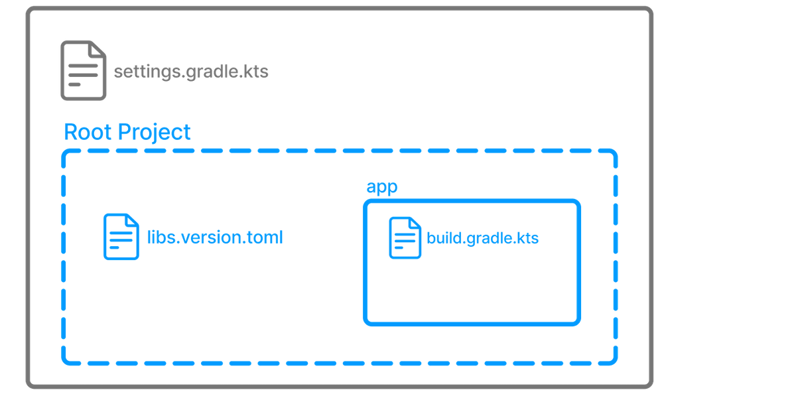

# Gradle

## Gradle Wrapper (Gradle обертка)

Обертка Gradle предпочтительный способ запуска Gradle сборки. Обертка скачивается при необходимости и затем вызывается
указанная в сборке версия.

В созданном проекте есть файлы, используемые оберткой Gradle в первую очередь. Shell-скрипт для macOS и Linux и
batch-скрипт для Windows.

Эти скрипты позволяют запускать Gradle без необходимости его установки в систему. Так же это позволяет гарантировать что
одна и та же версия Gradle используется разными разработчиками, локальными машинами и CI (continuous-integration)
машинами (серверами).

Использование установленного Gradle не рекомендуется (разве что для инициализации проекта), для использования есть
обертки Gradle.

### Вызов обертки Gradle

Для использования обертки Gradle, необходимо использовать один из двух файлов, ниже пример для запуска команды build:

Для macOS/Linux:

```
./gradlew build
```

Для Windows:

```
./gradlew.bat build
```

При первом запуске, обертка скачает и закэширует бинарники Gradle если они не установлены на машине.

Обертка Gradle сконструирована так, что она должна быть в системе контроля версий. Это необходимо чтобы каждый мог
построить проект без установки и настройки определенной версии Gradle.

После вызова команды `build`, обертка построила наш проект. Директория `app` включает новую папку `build`.

Все генерируемые файлы направляются в директорию `build`, если не указано иное.

## Структура проекта Gradle



1. Проект состоит из верхнеуровнего `settings.gradle(.kts)`
2. Корневого проекта (root project)
3. Одного или более подпроектов (subprojects), каждый из которых имеет собственный `build.gradle(.kts)`

Не рекомендуется, но возможно иметь `build.gradle(.kts)` в корневом проекте.

Файл `libs.versions.toml` является каталогом версий, который используется для управления зависимостями.

Этот проект состоит из:

1. Корневого проекта с названием **gradle_edu** и определенного с помощью `rootProject.name = "gradle_edu"` в
   `settings.gradle.kts`
2. Подпроекта с названием **app** и определенного с помощью `include("app")` в `settings.gradle.kts`

Корневой проект может быть в самом верху иерархии директорий или иметь собственную директорию

**Build**:

* Представляет собой сборку относящихся друг другу программных продуктов, которые можно билдить, тестировать и/или
  выпускать (release) вместе.
* По желанию может включать другие билды (дополнительное ПО такие, как библиотеки, плагины, инструменты времени сборки и
  т.д.)

**Project**

* Представляет одиночный кусок нашей архитектуры - библиотека, приложения, Gradle плагин и т.д.
* Может содержать другие проекты

## setting.gradle(.kts)

Проект состоит из одного или нескольких подпроектов (иногда называемых модули).

Gradle читает `setting.gradle(.kts)` чтобы определить, какие подпроекты входят в состав сборки проекта.

```kotlin
plugins {
    // Apply the foojay-resolver plugin to allow automatic download of JDKs
    id("org.gradle.toolchains.foojay-resolver-convention") version "0.4.0"
}

rootProject.name = "gradle_edu"
include("app")
```

Корневой проект `gradle_edu` включается в себя подпроект `app`

Команда `include` оборачивает директорию `app` в подпроект

## build.gradle(.kts)

Каждый подпроект содержит собственный файл `build.gradle(.kts)`.

`build.gradle(.kts)` - ключевой компонент процесса сборки определения задач необходимых для сборки проекта.
Этот файл читается и исполняется Gradle.

Файл `build.gradle(.kts)`, находящийся в подпроекте `app`:

```kotlin
/*
 * This file was generated by the Gradle 'init' task.
 *
 * This generated file contains a sample Java application project to get you started.
 * For more details take a look at the 'Building Java & JVM projects' chapter in the Gradle
 * User Manual available at https://docs.gradle.org/8.1/userguide/building_java_projects.html
 */

plugins {
    // Apply the application plugin to add support for building a CLI application in Java.
    application
}

repositories {
    // Use Maven Central for resolving dependencies.
    mavenCentral()
}

dependencies {
    // Use JUnit Jupiter for testing.
    testImplementation("org.junit.jupiter:junit-jupiter:5.9.1")

    // This dependency is used by the application.
    implementation("com.google.guava:guava:31.1-jre")
}

// Apply a specific Java toolchain to ease working on different environments.
java {
    toolchain {
        languageVersion.set(JavaLanguageVersion.of(17))
    }
}

application {
    // Define the main class for the application.
    mainClass.set("tutorial.App")
}

tasks.named<Test>("test") {
    // Use JUnit Platform for unit tests.
    useJUnitPlatform()
}
```

Этот скрипт сборки позволяется Gradle знать, какие зависимости и плагины использует подпроект `app` и где найти их.

## Просмотр доступных задач

Задача (task) основная единица работы, которая может быть завершена Gradle как часть сборки.

Следующая команда, выполненная в директории `gradle_edu`, выведет все доступные задачи для проекта.

```bash
./gradlew tasks
```

Этот список включает в себя команды, представленные плагином `application` и плагинами, которые он применяет:

```
> Task :tasks

------------------------------------------------------------
Tasks runnable from root project 'gradle_edu'
------------------------------------------------------------

Application tasks
-----------------
run - Runs this project as a JVM application

Build tasks
-----------
assemble - Assembles the outputs of this project.
build - Assembles and tests this project.
buildDependents - Assembles and tests this project and all projects that depend on it.
buildNeeded - Assembles and tests this project and all projects it depends on.
classes - Assembles main classes.
clean - Deletes the build directory.
jar - Assembles a jar archive containing the main classes.
testClasses - Assembles test classes.

Build Setup tasks
-----------------
init - Initializes a new Gradle build.
wrapper - Generates Gradle wrapper files.

Distribution tasks
------------------
assembleDist - Assembles the main distributions
distTar - Bundles the project as a distribution.
distZip - Bundles the project as a distribution.
installDist - Installs the project as a distribution as-is.

Documentation tasks
-------------------
javadoc - Generates Javadoc API documentation for the main source code.

Help tasks
----------
buildEnvironment - Displays all buildscript dependencies declared in root project 'gradle_edu'.
dependencies - Displays all dependencies declared in root project 'gradle_edu'.
dependencyInsight - Displays the insight into a specific dependency in root project 'gradle_edu'.
help - Displays a help message.
javaToolchains - Displays the detected java toolchains.
kotlinDslAccessorsReport - Prints the Kotlin code for accessing the currently available project extensions and conventions.
outgoingVariants - Displays the outgoing variants of root project 'gradle_edu'.
projects - Displays the sub-projects of root project 'gradle_edu'.
properties - Displays the properties of root project 'gradle_edu'.
resolvableConfigurations - Displays the configurations that can be resolved in root project 'gradle_edu'.
tasks - Displays the tasks runnable from root project 'gradle_edu' (some of the displayed tasks may belong to subprojects).

Verification tasks
------------------
check - Runs all checks.
test - Runs the test suite.

To see all tasks and more detail, run gradlew tasks --all

To see more detail about a task, run gradlew help --task <task>

BUILD SUCCESSFUL in 352ms
1 actionable task: 1 executed
```

Задачи могут отвечать за компиляцию, копирование и перемещение фйлов, создание JAR файлов, генерацию Javadoc, публикацию
артифактов в репозитории или другие этапы работы.

Так же можно просмотреть задачи доступные модулю `app`, используя следующую команду:

```bash
./gradlew :app:tasks
```

Для получения дополнительной информации в списке задач, используется параметр `--all`:

```bash
./gradlew tasks --all
```

## Создание задач

Gradle предлагает множество заранее созданных задач, которые могут использовать разработчики, чтобы улучшить скрипт
сборки.

Следующий пример копирует файлы `*.war` из директории `source` в директорию `target`, используя встроенную задачу
`Copy`:

```kotlin
tasks.register<Copy>("copyTask") {
    from("source")
    into("target")
    include("*.war")
}
```

Если добавить эту задачу в `build.gradle(.kts)` в модуль `app`, её можно выполнить, используя команду:

```bash
./gradlew :app:copyTask
```

Наиболее популярные задачи включают:

* Copy - копирует файлы
* Delete - удаляет файлы и директории
* Exec - выполняет произвольные команды ОС
* Zip - объединяет файлы в архив

## Зависимости между задачами

Часто задача требует чтобы другая задача выполнилась первой. Если задача Б использует вывод задачи А, тогда задача А
должна завершиться раньше чем задача Б начнется.

* Задача А может определять свои зависимости явно
* Задача А может зависеть от других задач неявно

Пример явной зависимости задач:

```kotlin
tasks.register("hello") {
    doLast {
        println("Hello!")
    }
}

tasks.register("greet") {
    doLast {
        println("How are you?")
    }
    dependsOn("hello")
}
```

В этом примере `hello` напечатается раньше чем `greet`. Вывод `Hello! How are you?`

Порядок выполнения задач автоматически определяется Gradle c учетом явных и неявных зависимостей задач. Если между
задачами нет зависимостей, Gradle позволяет пользователю запросить определенный порядок исполнения.

## Управление зависимостями

### Каталог версий

Каталог версий используется для определения всех прямых зависимостей проекта в одном месте.

По умолчанию Gradle создает каталог версий в `gradle/libs.versions.toml` и ссылается на него во всех модулях.

**libs.versions.toml**

```
[versions]
guava = "32.1.2-jre"
junit-jupiter = "5.10.0"

[libraries]
guava = { module = "com.google.guava:guava", version.ref = "guava" }
junit-jupiter = { module = "org.junit.jupiter:junit-jupiter", version.ref = "junit-jupiter" }
```

Чтобы ссылаться на версии зависимостей, определенные в каталоге версий используется следующий синтаксис:

```kotlin
dependencies {
    implementation(libs.guava)
    testImplementation(libs.junit.jupiter)
}
```

Для `libs.junit.jupiter` используется такой синтаксис, потому что `-` - это специальный символ.

Каталог версий предлагает множество преимуществ над определением зависимостей напрямую в файле сборки:

* Gradle генерирует типобезпасный доступ в каталог, так что мы можем легко добавлять зависимости с автодополнением в
  IDE.
* Это центральное место для определения версий зависимостей, таким образом изменения применяются ко всем модулям.

### Зависимости проектов

Gradle предлагает превосходную поддержку для управления зависимостями и автоматизации.

```kotlin
repositories {
    // Use Maven Central for resolving dependencies.
    mavenCentral()
}

dependencies {
    // Use JUnit Jupiter for testing.
    testImplementation(libs.junit.jupiter)

    testRuntimeOnly("org.junit.platform:junit-platform-launcher")

    // This dependency is used by the application.
    implementation(libs.guava)
}
```

Одни из ключевых концептов, которые включает в себя управление зависимостями Gradle^

Repositories - репозитории - источник зависимостей -> `mavenCentral()`

Maven Central это коллекция jar файлов, плагинов и библиотек предлагаемых сообщество Maven и поддерживаемых Sonatype.
Это по факту публичное хранилище артифактов для Java и оно используется множеством систем сборки.

Dependencies - зависимости - зависимости определяются через типы конфигурации -> `libs.junit.jupiter` и ` libs.guava`

Gradle нуждается в специальной информации, чтобы найти зависимость:

|        | Описание                  | com.google.guava:guava:32.1.2-jre | org.junit.jupiter:junit-jupiter-api:5.9.1 |
|:-------|:--------------------------|:----------------------------------|:------------------------------------------|
| Группа | Идентификатор организации | com.google.guava                  | org.junit.jupiter                         |
| Имя    | Идентификатор зависимости | guava                             | junit-jupiter-api                         |
| Версия | Версия # для импорта      | 32.1.2-jre                        | 5.9.1                                     |

### Транзитивные зависимости

Транзитивная зависимость - это зависимость зависимости.

Для зависимости `guava` требуется библиотека называемая `failureaccess`. `failureaccess` это транзитивная зависимость
проекта. То есть зависимость, которая поставляется другими зависимостями.

### Просмотр зависимостей проекта

Чтобы просмотреть дерево зависимостей проекта, необходимо использовать команду `./gradlew :app:dependecies`:

```bash
> Task :app:dependencies

------------------------------------------------------------
Project ':app'
------------------------------------------------------------

annotationProcessor - Annotation processors and their dependencies for source set 'main'.
No dependencies

compileClasspath - Compile classpath for source set 'main'.
Path for java installation '/usr/lib/jvm/openjdk-17' (Common Linux Locations) does not contain a java executable
\--- com.google.guava:guava:31.1-jre
     +--- com.google.guava:failureaccess:1.0.1
     +--- com.google.guava:listenablefuture:9999.0-empty-to-avoid-conflict-with-guava
     +--- com.google.code.findbugs:jsr305:3.0.2
     +--- org.checkerframework:checker-qual:3.12.0
     +--- com.google.errorprone:error_prone_annotations:2.11.0
     \--- com.google.j2objc:j2objc-annotations:1.3

compileOnly - Compile only dependencies for source set 'main'. (n)
No dependencies

default - Configuration for default artifacts. (n)
No dependencies

implementation - Implementation only dependencies for source set 'main'. (n)
\--- com.google.guava:guava:31.1-jre (n)

mainSourceElements - List of source directories contained in the Main SourceSet. (n)
No dependencies

runtimeClasspath - Runtime classpath of source set 'main'.
\--- com.google.guava:guava:31.1-jre
     +--- com.google.guava:failureaccess:1.0.1
     +--- com.google.guava:listenablefuture:9999.0-empty-to-avoid-conflict-with-guava
     +--- com.google.code.findbugs:jsr305:3.0.2
     +--- org.checkerframework:checker-qual:3.12.0
     +--- com.google.errorprone:error_prone_annotations:2.11.0
     \--- com.google.j2objc:j2objc-annotations:1.3

runtimeElements - Elements of runtime for main. (n)
No dependencies

runtimeOnly - Runtime only dependencies for source set 'main'. (n)
No dependencies

testAnnotationProcessor - Annotation processors and their dependencies for source set 'test'.
No dependencies

testCompileClasspath - Compile classpath for source set 'test'.
+--- com.google.guava:guava:31.1-jre
|    +--- com.google.guava:failureaccess:1.0.1
|    +--- com.google.guava:listenablefuture:9999.0-empty-to-avoid-conflict-with-guava
|    +--- com.google.code.findbugs:jsr305:3.0.2
|    +--- org.checkerframework:checker-qual:3.12.0
|    +--- com.google.errorprone:error_prone_annotations:2.11.0
|    \--- com.google.j2objc:j2objc-annotations:1.3
\--- org.junit.jupiter:junit-jupiter:5.9.1
     +--- org.junit:junit-bom:5.9.1
     |    +--- org.junit.jupiter:junit-jupiter:5.9.1 (c)
     |    +--- org.junit.jupiter:junit-jupiter-api:5.9.1 (c)
     |    +--- org.junit.jupiter:junit-jupiter-params:5.9.1 (c)
     |    \--- org.junit.platform:junit-platform-commons:1.9.1 (c)
     +--- org.junit.jupiter:junit-jupiter-api:5.9.1
     |    +--- org.junit:junit-bom:5.9.1 (*)
     |    +--- org.opentest4j:opentest4j:1.2.0
     |    +--- org.junit.platform:junit-platform-commons:1.9.1
     |    |    +--- org.junit:junit-bom:5.9.1 (*)
     |    |    \--- org.apiguardian:apiguardian-api:1.1.2
     |    \--- org.apiguardian:apiguardian-api:1.1.2
     \--- org.junit.jupiter:junit-jupiter-params:5.9.1
          +--- org.junit:junit-bom:5.9.1 (*)
          +--- org.junit.jupiter:junit-jupiter-api:5.9.1 (*)
          \--- org.apiguardian:apiguardian-api:1.1.2

testCompileOnly - Compile only dependencies for source set 'test'. (n)
No dependencies

testImplementation - Implementation only dependencies for source set 'test'. (n)
\--- org.junit.jupiter:junit-jupiter:5.9.1 (n)

testRuntimeClasspath - Runtime classpath of source set 'test'.
+--- com.google.guava:guava:31.1-jre
|    +--- com.google.guava:failureaccess:1.0.1
|    +--- com.google.guava:listenablefuture:9999.0-empty-to-avoid-conflict-with-guava
|    +--- com.google.code.findbugs:jsr305:3.0.2
|    +--- org.checkerframework:checker-qual:3.12.0
|    +--- com.google.errorprone:error_prone_annotations:2.11.0
|    \--- com.google.j2objc:j2objc-annotations:1.3
\--- org.junit.jupiter:junit-jupiter:5.9.1
     +--- org.junit:junit-bom:5.9.1
     |    +--- org.junit.jupiter:junit-jupiter:5.9.1 (c)
     |    +--- org.junit.jupiter:junit-jupiter-api:5.9.1 (c)
     |    +--- org.junit.jupiter:junit-jupiter-engine:5.9.1 (c)
     |    +--- org.junit.jupiter:junit-jupiter-params:5.9.1 (c)
     |    +--- org.junit.platform:junit-platform-commons:1.9.1 (c)
     |    \--- org.junit.platform:junit-platform-engine:1.9.1 (c)
     +--- org.junit.jupiter:junit-jupiter-api:5.9.1
     |    +--- org.junit:junit-bom:5.9.1 (*)
     |    +--- org.opentest4j:opentest4j:1.2.0
     |    \--- org.junit.platform:junit-platform-commons:1.9.1
     |         \--- org.junit:junit-bom:5.9.1 (*)
     +--- org.junit.jupiter:junit-jupiter-params:5.9.1
     |    +--- org.junit:junit-bom:5.9.1 (*)
     |    \--- org.junit.jupiter:junit-jupiter-api:5.9.1 (*)
     \--- org.junit.jupiter:junit-jupiter-engine:5.9.1
          +--- org.junit:junit-bom:5.9.1 (*)
          +--- org.junit.platform:junit-platform-engine:1.9.1
          |    +--- org.junit:junit-bom:5.9.1 (*)
          |    +--- org.opentest4j:opentest4j:1.2.0
          |    \--- org.junit.platform:junit-platform-commons:1.9.1 (*)
          \--- org.junit.jupiter:junit-jupiter-api:5.9.1 (*)

testRuntimeOnly - Runtime only dependencies for source set 'test'. (n)
No dependencies

(c) - A dependency constraint, not a dependency. The dependency affected by the constraint occurs elsewhere in the tree.
(*) - Indicates repeated occurrences of a transitive dependency subtree. Gradle expands transitive dependency subtrees only once per project; repeat occurrences only display the root of the subtree, followed by this annotation.

(n) - A dependency or dependency configuration that cannot be resolved.

A web-based, searchable dependency report is available by adding the --scan option.
```

### Просмотр зависимостей используя Build Scan

Для просмотра зависимостей используя [Build Scan](https://scans.gradle.com/) необходимо запустить `build` с опцией
`--scan`.

```bash
$ ./gradlew build --scan
Path for java installation '/usr/lib/jvm/openjdk-17' (Common Linux Locations) does not contain a java executable

BUILD SUCCESSFUL in 818ms
8 actionable tasks: 6 executed, 2 up-to-date

Publishing a build scan to scans.gradle.com requires accepting the Gradle Terms of Service defined at https://gradle.com/terms-of-service. Do you accept these terms? [yes, no] yes 

Gradle Terms of Service accepted.

Publishing build scan...
https://gradle.com/s/link

$ 
```

[Build Scan](https://scans.gradle.com/) - доступная для общего доступа и централизованная запись сборки доступная в
качестве бесплатного сервиса от Gradle. На вкладке со сканом можно найти всю необходимую информацию о сборке проекта.

### Обновление зависимостей проекта

Добавить и изменить зависимость достаточно в файле сборки каталоге версий
Изменение зависимости `guava`

```

[versions]
guava = "30.0-jre"
junit-jupiter = "5.10.0"

[libraries]
guava = { module = "com.google.guava:guava", version.ref = "guava" }
junit-jupiter = { module = "org.junit.jupiter:junit-jupiter", version.ref = "junit-jupiter" }

```

Версия зависимостей обновлена везде, где она используется

## Применение плагинов

Плагины основной метод организации логики сборки и переиспользования логики сборки в проекте.

Плагины так же используются для распространения собственных задач как упакованного кода

При применении плагина к проекту выполняется код, который может создавать задачи, настраивать свойства и иным образом
расширять возможности проекта. Как правило, плагины используют Gradle API для предоставления дополнительной
функциональности и расширения основных возможностей Gradle.

Плагины могут:

* Добавлять задачи в проект (например, компилировать, тестировать).
* Расширять базовую модель Gradle (например, добавлять новые элементы DSL, которые можно настраивать).
* Настроить проект в соответствии с соглашениями (например, добавить новые задачи или настроить разумные значения по
  умолчанию).
* Применять определенную конфигурацию (например, добавить организационные хранилища или применить стандарты).
* Добавлять новые свойства и методы к существующим типам с помощью расширений.

### Применение плагинов

Текущий проект уже применяет единственный
плагин [Application Plugin](https://docs.gradle.org/current/userguide/application_plugin.html#application_plugin),
который поставляется вместе с Gradle.

```kotlin


plugins {
    // Apply the application plugin to add support for building a CLI application in Java.
    application
}


```

Применим к проекту еще один плагин, который поддерживается и распространяется Gradle и
называется [Maven Publish Plugin](https://docs.gradle.org/current/userguide/publishing_maven.html#publishing_maven).

Maven Publish Plugin прелагает возможность публиковать артифакты сборки в репозиторий Apache Maven. Так же можно
публиковать в локальный репозиторий maven, который расположений на компьютере.

Пути по умолчанию могут различаться, но умолчанию они располагаются:

* Mac: /Users/\[username]/.m2
* Linux: /home/\[username]/.m2
* Windows: C:\Users\[username]\.m2

Публикация направленная для репозитория Maven обычно включает:

* Один или более артифактов
* Модуль метаданных Gradle
* Файл Maven POM

Применим плагин добавлением `maven-public` в блок плагинов в `build.gradle(.kts)`:

```kotlin


plugins {
    // Apply the application plugin to add support for building a CLI application in Java.
    application
    id("maven-publish")
}


```

Для того чтобы убедиться, что плагин применился необходимо просмотреть задачи проекта^

```bash


$ ./gradlew :app:tasks

> Task :app:tasks

------------------------------------------------------------
Tasks runnable from project ':app'
------------------------------------------------------------

...

Publishing tasks
----------------
publish - Publishes all publications produced by this project.
publishToMavenLocal - Publishes all Maven publications produced by this project to the local Maven cache.

```

Новые задачи называются `publish` и `publishToMavenLocal`.

### Конфигурация плагина

Добавление информации о публикации в `build.gradle(.kts)`

```kotlin


publishing {
    publications {
        create<MavenPublication>("maven") {
            groupId = "com.gradle.gradle_edu"
            artifactId = "gradle_edu"
            version = "1.0"

            from(components["java"])
        }
    }
}


```

После повторного просмотра доступных задач, можно увидеть новые задачи

```bash


$ ./gradlew :app:tasks

> Task :app:tasks

------------------------------------------------------------
Tasks runnable from project ':app'
------------------------------------------------------------

...

Publishing tasks
----------------
generateMetadataFileForMavenPublication - Generates the Gradle metadata file for publication 'maven'.
generatePomFileForMavenPublication - Generates the Maven POM file for publication 'maven'.
publish - Publishes all publications produced by this project.
publishMavenPublicationToMavenLocal - Publishes Maven publication 'maven' to the local Maven repository.
publishToMavenLocal - Publishes all Maven publications produced by this project to the local Maven cache.

```

### Использование плагина

Чтобы использовать плагин, необходимо запустить задачу `publishToMavenLocal`

Задача `publishToMavenLocal` соберет POM файл и артифакты для публикации. Затем они установятся в локальный Maven
репозиторий.

Файл POM и GMM можно посмотреть в директории `build`.

Так же файлы установятся в локальный репозиторий Maven.

### Поиск плагинов

Плагины используются для расширения возможностей сборки и настройки Gradle.

Использование плагинов является основным механизмом организации логики сборки.

Авторы плагинов могут либо сохранять свои плагины в тайне, либо распространять их публично. Таким образом, плагины
распространяются тремя способами:

* Основные плагины - Gradle разрабатывает и поддерживает
  набор [основных плагинов](https://docs.gradle.org/current/userguide/plugin_reference.html#plugin_reference).
* Плагины сообщества - Сообщество Gradle предоставляет доступ к плагинам
  через [портал плагинов Gradle](https://plugins.gradle.org/).
* Пользовательские плагины - Gradle позволяет пользователям создавать пользовательские плагины с
  использованием [API](https://docs.gradle.org/current/dsl/org.gradle.api.tasks.javadoc.Javadoc.html).

[Конвенционные плагины (Convention plugins)](https://docs.gradle.org/current/samples/sample_convention_plugins.html) -
это плагины,
используемые для обмена логикой построения между подпроектами (модулями). Пользователи могут использовать общую логику в
конвенционном плагине. Например, плагин покрытия кода, используемый в качестве конвенционного плагина, может отслеживать
покрытие кода для всего проекта, а не только для конкретного подпроекта.

Gradle настоятельно рекомендует использовать конвенционные плагины.

## Инкрементальная сборка

Важно знать, Gradle оптимизирует сборку различными способами. Одна из таких оптимизаций называется инкрементной сборкой.

Инкрементная сборка - это сборка, которая позволяет избежать запуска задач, входные данные которых не менялись со
времени предыдущей сборки, что делает выполнение таких задач ненужным.

Чтобы инкрементные сборки работали, задачи должны определять свои входные и выходные данные. Во время сборки Gradle
определит, изменились ли входные или выходные данные. Если они изменились, Gradle выполнит задачу. В противном случае
выполнение будет пропущено.

Чтобы лучше видеть инкрементальные сборки в действии, необходимо переключить вывод консоли в `verbose`.

Для этого необходимо создать в корневой папке файл `gradle.properties`. И добавить в него строчку
`org.gradle.console=verbose`.

**gradle.properties**

```
org.gradle.console=verbose
```

Далее необходимо запустить сборку командой `./gradlew :app:clean :app:build` и получим вывод

```bash
> Task :app:clean
> Task :app:compileJava
> Task :app:processResources
> Task :app:classes
> Task :app:jar
> Task :app:startScripts
> Task :app:distTar
> Task :app:distZip
> Task :app:assemble
> Task :app:compileTestJava
> Task :app:processTestResources NO-SOURCE
> Task :app:testClasses
> Task :app:test
> Task :app:check
> Task :app:build

BUILD SUCCESSFUL in 1s
9 actionable tasks: 9 executed
```

Затем команду `./gradlew :app:build` и получим новый вывод

```bash
> Task :app:compileJava UP-TO-DATE
> Task :app:processResources UP-TO-DATE
> Task :app:classes UP-TO-DATE
> Task :app:jar UP-TO-DATE
> Task :app:startScripts UP-TO-DATE
> Task :app:distTar UP-TO-DATE
> Task :app:distZip UP-TO-DATE
> Task :app:assemble UP-TO-DATE
> Task :app:compileTestJava UP-TO-DATE
> Task :app:processTestResources NO-SOURCE
> Task :app:testClasses UP-TO-DATE
> Task :app:test UP-TO-DATE
> Task :app:check UP-TO-DATE
> Task :app:build UP-TO-DATE

BUILD SUCCESSFUL in 367ms
8 actionable tasks: 8 up-to-date
```

Большинство задач теперь имеют метку `UP_TO_DATE`. Это то как Gradle дает знать о том что ввод и вывод не изменились и
запускать задачу не имеет смысла.

| Метка      | Описание                                                                                                        |
|:-----------|:----------------------------------------------------------------------------------------------------------------|
| UP-TO-DATE | Задача уже была выполнена и не изменилась (особенность инкрементальной сборки)                                  |
| SKIPPED    | Задача была явно исключена из запуска                                                                           |
| FROM-CACHE | Вывод задачи был скопирован в локальную директорию из предыдущих сборок в кэше сборки (особенность кэширования) |
| NO-SOURCE  | Задача не была запущено, потому что необходимый ввод не доступен                                                |

Для задач, которые были исполнены маркера нет.

## Включение кэширование сборки Gradle

Инкрементальные сборки - это отличная оптимизация, которая помогает избежать уже выполненной работы. Если разработчик
постоянно вносит изменения в один файл, скорее всего, нет необходимости перестраивать все остальные файлы в проекте.

Однако что происходит, когда тот же разработчик решает перейти к новой ветке, созданной на прошлой неделе? Файлы
перестраиваются, даже если разработчик создает что-то, что было создано ранее.

Вот где полезен кэш сборки. Кэш хранит предыдущие результаты сборки и значительно сокращает необходимость в перестройке
объектов, которые уже были собраны локально.

Для включения кэширования необходимо добавить `org.gradle.caching=true` в файл `gradle.properties`.

После этого запустим `./gradlew :app:clean :app:build`

```bash
> Task :app:clean
> Task :app:compileJava
> Task :app:processResources
> Task :app:classes
> Task :app:jar
> Task :app:startScripts
> Task :app:distTar
> Task :app:distZip
> Task :app:assemble
> Task :app:compileTestJava
> Task :app:processTestResources NO-SOURCE
> Task :app:testClasses
> Task :app:test
> Task :app:check
> Task :app:build

BUILD SUCCESSFUL in 1s
9 actionable tasks: 9 executed
```

И затем `./gradlew :app:build`

```bash
> Task :app:compileJava UP-TO-DATE
> Task :app:processResources UP-TO-DATE
> Task :app:classes UP-TO-DATE
> Task :app:jar UP-TO-DATE
> Task :app:startScripts UP-TO-DATE
> Task :app:distTar UP-TO-DATE
> Task :app:distZip UP-TO-DATE
> Task :app:assemble UP-TO-DATE
> Task :app:compileTestJava UP-TO-DATE
> Task :app:processTestResources NO-SOURCE
> Task :app:testClasses UP-TO-DATE
> Task :app:test UP-TO-DATE
> Task :app:check UP-TO-DATE
> Task :app:build UP-TO-DATE

BUILD SUCCESSFUL in 3s
8 actionable tasks: 8 up-to-date
```

И еще раз `./gradlew :app:clean :app:build`

```bash
> Task :app:clean
> Task :app:compileJava FROM-CACHE
> Task :app:processResources
> Task :app:classes
> Task :app:jar
> Task :app:startScripts
> Task :app:distTar
> Task :app:distZip
> Task :app:assemble
> Task :app:compileTestJava FROM-CACHE
> Task :app:processTestResources NO-SOURCE
> Task :app:testClasses UP-TO-DATE
> Task :app:test
> Task :app:check
> Task :app:build

BUILD SUCCESSFUL in 1s
9 actionable tasks: 7 executed, 2 from cache
```

Gradle дает знать о том что:

* `FROM-CACHE` - задачи были получены из локального кэша сборки
* `UP-TO-DATE` - задачи, которые используют инкрементальную сборку и не были запущены

Подводя итог:

* Сначала мы использовали задачу `build` для заполнения нашего локального кэша входными и выходными данными задачи — мы
  можем представить, что это было сделано неделю назад.
* Затем мы использовали задачу `clean` для имитации переключения ветвей, переопределяя предыдущие выходные данные.
* Наконец, мы использовали задачу `build` — в отличие от инкрементных сборок, предыдущие выходные данные хранились в
  локальном кэше и могли быть использованы повторно.

Gradle эффективен, особенно при включенном локальном кэше сборки. Gradle проверит каталог кэша на вашем компьютере на
наличие выходных файлов, которые, возможно, уже существуют. Если это так, вместо выполнения этой задачи он скопирует
свои (выходные) результаты в каталог сборки вашего проекта.

Метка результата FROM-CACHE позволяет пользователю узнать, что Gradle извлек результаты задачи из локального кэша
сборки.

Локальный кэш сборки Gradle находится по адресу:

* В Windows: %USERPROFILE%\.gradle\caches
* В OS X / UNIX: ~/.gradle/caches/

Gradle будет периодически очищать локальный каталог кэша сборки, удаляя записи, которые в последнее время не
использовались, для экономии места на диске.

В дополнение к локальному кэшу сборки, имеющемуся на компьютере разработчика, Gradle может использовать удаленные кэши
сборки, которые могут использоваться несколькими разработчиками.

Идея удаленного кэша заключается в совместном использовании результатов выполнения задач в удаленных сборках для
увеличения времени сборки.

Когда включены как удаленное, так и локальное кэширование, выходные данные сборки сначала проверяются в локальном кэше.
Если выходные данные отсутствуют в локальном кэше, они будут загружены из удаленного кэша и также сохранены в локальном
кэше.

Чтобы опробовать удаленный кэш сборки, Gradle предоставляет бесплатный [образ Docker](https://hub.docker.com/r/gradle/build-cache-node) для одного узла удаленного кэша
сборки. Для развертываний производственного уровня рекомендуется
использовать [Develocity](https://gradle.com/gradle-enterprise-solutions/build-cache/?_gl=1*v3u8vp*_ga*NjEwMzA4MDg2LjE3MzYyNDU3ODU.*_ga_7W7NC6YNPT*MTczNjg2NDQxNi44LjEuMTczNjg2NTA3OC41OS4wLjA.*_gcl_au*NTE1Mjc0MDczLjE3MzYyNDU3ODQ.).